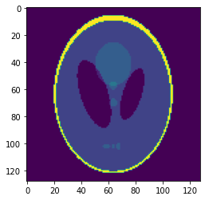
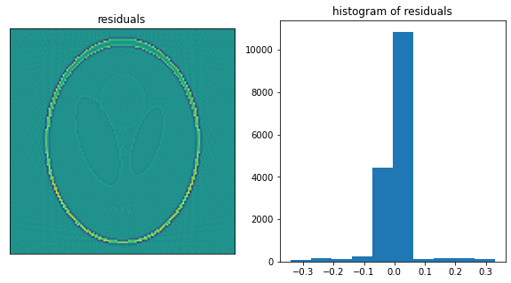
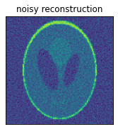
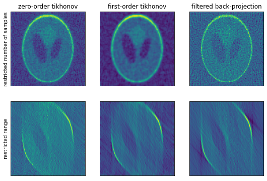
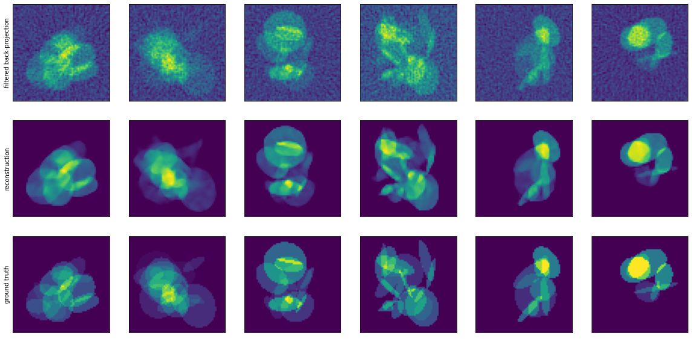
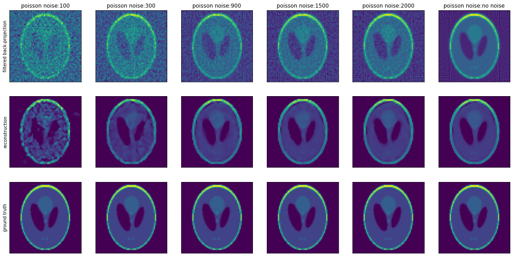

# Radon-Transform-Denoising
Comparing classical regularisation approaches to deep learning for the task of denoising data generated from the radon transform process.

The data examined is the [Shepp–Logan phantom](https://en.wikipedia.org/wiki/Shepp%E2%80%93Logan_phantom).

When the radon transform (and inverse) are applied using adequately sampled points with no noise, a near perfect reconstruction can occur.

However, noise in the forward transform leads to a distinctive radial noise pattern in resulting reconstruction, due to the integration step of the analytical solution.

## Classic regularisation denoising
Classic regularisation techniques are show, specifically zero-order and first-order tikhonov regularisation, which mitigate some of the effects but radial noise remains.

## Deep Learning denoising
A deep learning model with a UNet design is trained on synthesised data with varying levels of noise applied.

Performance is then evaluated on the original Shepp–Logan phantom at varying noise levels.

